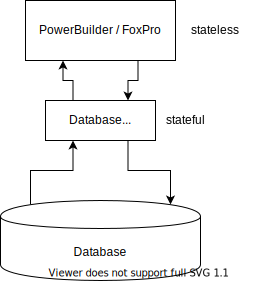

# state-management

各种需求场景下的状态管理方案

```sh
yarn config set registry http://registry.npm.chengfayun.net
git clone https://git.chengfayun.com/demo/dev
yarn install
yarn venv-install
cd trillion/demo/state-management
yarn start scenario1
yarn start main-svc
```

# 状态管理的问题是什么

## 2-tier 架构

远古时期，状态是完全由数据库管理的。数据库提供的连接是有状态的，打开页面的时候开连接，页面上的改动直接提交到当前的数据库连接。数据库连接的状态就是页面状态。从状态的角度来说，可有说只有一层状态，就是都在数据库里。



## 3-tier 架构

后来因为互联网类型的应用的发展，数据库无法承受更多的连接。所以页面打开的时候不再开数据库连接了，仅仅在渲染和提交操作的时候才开连接拿数据。有状态的数据库连接是被极大弱化了，甚至因为引入了 nosql 而不存在了。在服务端 jsp 直接渲染页面的 B/S 架构年代


虽然多了一层，但是总体来说仍然是非常简单的

* 不存在两层复制状态需要同步的问题。基本上还是以 database 为准，每一步操作都落盘。
* 不需要额外定义通信接口，状态同步也不会有什么花样：基本上就是 SQL，request / response

## 4-tier 架构

静态 html 页面的问题是 I/O 太慢了。所有的操作都需要提交到 database，然后再完整重新渲染。虽然 Ruby on Rails 有 Render Partial 之类的优化，可以用 jQuery 做一个局部 div 的部分刷新。但是仍然需要在网络走一个完整的来回。现代的 Web Ui 需要操作更立即响应，需要在前端浏览器进行本地的计算和状态管理。这就事实上变成了 4 tier 的架构。


引入 React 之后，整体的复杂度急剧上升：

* 存在了三层状态：数据库的状态，React全局store中的状态，每个React组件的本地状态。这三者之间都有业务上的强一致性联系。
* 前后端之间的接口定义没有统一标准，既不是以后端的数据结构为准，也不是以前端的数据结构为准。
* 状态同步的时机选择：除了标准的 request / response，有了更多的选择。比如可以有批量提交，提前预取等

## 5-tier 架构

更现代的 Ui 要求在界面上有更及时的动效反馈。例如滑动的时候可以有弹簧的效果，页面切换的时候可以有滑出的效果。动画的特点是要求至少 30 fps，也就是在 1000 / 30 ms 的时间内要计算出一帧的数据状态，然后拿去做重渲染。用 javascript 勉强可以达到流畅，但是如果加上 React 的 virtual dom 计算就做不到流畅了。所以在 React / DOM 之间又架了一层“动画状态”层，比如 react-spring。这一层控制动效的状态可以理解为 5th tier。


* 存在了4层状态：动画额外有一个独立于 React Component 的状态存储，会直接和 DOM 进行绑定。
* React Component 变成三个方向同步：除了要照顾本地的 DOM，以及全局的 store，还要和动画的状态进行同步。

## I/O 开销是背后的黑手

从 2-tier 到 5-tier 的驱动力至始至终都是相同的，就是 I/O 开销。因为动画计算不能发送到 React 端去计算，必须在 DOM 内本地计算，也是一种对 I/O 的优化。而不断优化 I/O 的背后是用户对 Ui 体验越来越苛刻的要求。

未来会怎么发展？会不会因为 5G 网络的发展使得 3-tier 架构复兴？目前来看，光速短期只能无法被克服，面向延迟优化的倾向是不会变的，除非现代物理学有重大突破。同时因为大家对于跨屏融合体验的要求越来越高，家里有小度的音箱，有投影仪，有手机。我们预期的是这些设备的体验是一体的，和你在一个显示器上的多个窗口不应该有本质区别。这样带来的结果必然是 5-tier 上还要再架上几层。

除了 UI 交互这块，还有 Data Pipeline 这一块


和 UI 的变化一样，其背后推手也是 I/O 开销。为了更高性能的查询，需要把状态进行多次复制，以不同的方式进行存储。

## 状态管理的问题总结

* 要管理的状态太多了：每一份状态都需要一份注意力，就需要额外的人手去维护他。而技术栈的分化，导致管理不同的状态要求的人员技能背景是完全不同的。这导致需要更多的专业化团队。每个专业化的团队关注的只是业务上的一个环节，而不是一个完整的端到端的业务。
* 层与层之间的沟通成本：包括开发成本和运行时成本。往往两份状态之间用很随意的方式进行联系，比如页面上的点击，到报表的记录，中间可能要经过一个很不起眼的日志文件。又比如前后端通信的 RESTful 接口，各种定义的方式都有。这会不仅仅导致一次性开发成本的增加，更加会引起长期跟踪业务问题的成本的上升。
* 每一层本身的专注性：React 组件都需要把后端的状态先复制一份到本地，把各种外部状态都归并为浏览器内存中的状态。类似做法在后端，在data pipeline的业务逻辑里也有，都要把自己的业务和外边的I/O做一层基于复制的隔离。相当于每个模块每个环节都要把周边的数据都要重新建模一份到自己这里，把自己和上下游隔离清楚。

理想的状态管理是让所有人都关注在业务逻辑上，而不是 I/O 上。所谓业务逻辑，就是数据与数据之间的规则关系。

* 减少需要手工管理的状态：把状态托管掉，实现自动化的同步，就像 React 理想中的 "UI = f(data)" 那样，当一份状态是另外一份状态的函数的时候，就可以认为这份状态不存在了。
* 标准化状态查询与修改方式：可以从界面 label 一直追溯到数据库字段。从报表的一行，追溯到界面上的按钮。每一种交互都有一种标准的写法。
* 专注在自己的业务上：消除各种状态管理技术上的差异性，实现互联互通。无论是在前端取数据，还是后端取数据都是同样的写法。每个环节都关注在自己要表达的业务逻辑上，而不是数据是如何搬家的细节上。

# 如何解决这些问题

我们用以下例子来详细说明使用 TSM 的收益

## 已提供的最佳写法

1. [纯前端简单表单](src/Scenario1)
1. [父子表单以及后端校验](src/Scenario2)
1. [界面绑定数据库](src/Scenario3)
1. [批量操作型界面](src/Scenario4)
1. [无限滚动](src/Scenario5)

## 待提供的最佳写法

1. 分页表格
1. 超出组件生命周期的前端状态
1. 按钮操作提示操作中/加载中
1. 出错提示
1. 前端路由的懒加载和预加载
1. 接口和数据鉴权
1. 优化数据批量加载效率
1. 优化闪屏和一闪而过的loading体验
1. 拖拽
1. 动画效果

