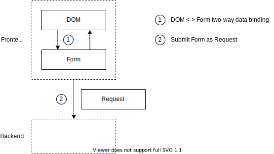

# 纯前端简单表单

这个例子演示的是 TSM 做为一个传统前端框架的用法。覆盖的状态范围如下图所示




代码中 ContactForm 承担了 DOM 状态，表单状态，以及 Request 状态三个角色。

在这个案例里，突出体现了如下几个特性

# 强约束的框架

TSM 的目标是完全接管系统中各个部位的状态，是一个强约束的框架。顶层的目录结构

* app 编译出来的前后端代码，和 application 目录一一对应
* application 你定义的这个系统分多少个 app，至少应该包括前端一个 app，后端一个 app。同时一些固定的 conf 可以放在 app 的 src/conf 下
* build / esm / lib / stub：这四个是构建的中间产物
* src 源代码只能写在这里
* triones.json 代替了 package.json

在 src 目录下，代码也不是可以随意放置的，而是要遵循严格的规范

* Scenario1 / Public 其中 A / B 这个部分代表了业务领域划分。比如 Merchandise / Sell 或者 Security / Auth 这样的命名。Public 代表这里放的是后端可公开查询的数据
* Scenario1 / Private 其中 Private 代表了后端不对外公开查询的数据
* Scenario1 / Ui 这里是前端的数据
* 在 Public / Private / Ui 下可以再分子目录来表示进一步的分类

从 src 的目录划分可以看出 TSM 和 RoR 的区别。

TSM 是一个把前后端代码放在一个大工程下的写法。Ui 对应的后端代码应该放得更靠近一些，以体现两者之间的密切协作关系。
RoR 的顶层目录不是业务领域，而是 Controller / Model 这样的业务无关的分类。

# 表单状态绑定

和 Vue 一样，提供了对表单状态的直接支持。*.tm 文件和 *.ts 文件一一对应，呈绑定关系。

* `<Input :value="&name" />` 双向绑定的用法。绑定到对应 ts 文件里的 name 字段
* `<button @onClick="onMinus">-</button>{{ value }}<button @onClick="onPlus">+</button>` 单向绑定，由业务代码自己控制 command 如何处理

和 Vue 不同的地方在于，TSM 规定了 tm 可以写什么，ts 可以写什么，而不是随意发挥。在 tm 文件中无法写表达式，如果需要绑定的数据需要经过 transform，需要把对应的逻辑写到 ts 里。


```ts
    public get square() {
        return this.value * this.value;
    }
```

# 前后端通信

前端把用户在表单里填写的内容，通过 RPC 接口传递给后端。因为 TSM 把前后端代码囊括在了一个项目里，所以在前后端通信这个应用场景下可以节省大量传统上在两侧的工程里需要写的声明定义。

* `this.call(SaveCounter, this)` 后端写一个 Biz.Command，前端就可以 this.call
* `public run(form: CounterForm)` 无需额外定义 *.proto 协议文件，或者定义 DTO 对象。直接拿前端的表单定义当网络传输协议

后端服务启动使用命令 yarn start main-svc，其中 main-svc 对应了 application/main-svc/package.json，定义如下

```json
{
    "service": {
        "type": "http",
        "port": 8000
    },
    "host": {
        "type": "nodejs",
        "entry": "Octopus/Http/Backend"
    },
    "boundary": [
        {
            "keep": "ALL"
        }
    ]
}
```

这里 Octopus 是 triones 使用的默认 RPC 协议的名字。之所以前后端知道使用这个 RPC 协议，是因为我们在 app 的入口点上做了声明。前端的声明

```ts
@instantiate(ReactHost, { area: 'Scenario1/Ui' })
export class CounterForm extends Biz.MarkupView {
```

这里引用的 ReactHost 就声明了使用 React 宿主环境来执行当前这个组件，默认的 React 宿主代码里使用的就是 TSM 提供的 Octopus 协议。后端的入口点在上面所示的 package.json 里定义为 Octopus/Http/Backend，对应的代码是在 triones.json 里引入进来的

# 总结

使用 Vue / GraphQL 等技术搭好脚手架也能达到同样的效果。TSM 相比之下节省了你的技术团队自己摸索这个最佳组合方案的时间，也统一了项目代码的风格，方便人员的换组。