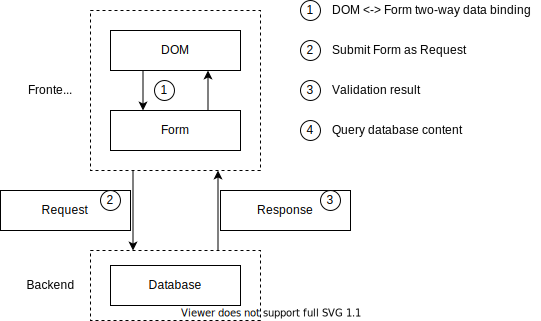

# 父子表单以及后端校验

这个例子演示了更复杂的前端父子表单，以及如何在后端进行数据校验并回显错误。覆盖的状态范围如下图所示：



代码中的

* CounterForm / CounterList 承担了 DOM状态，表单状态，Request状态 以及 Response 状态四个角色
* Counter 承担了数据库状态和 Response 状态的角色

在这个案例里，突出体现了如下几个特性

# 前端状态建模

所谓父子表单，复杂表单，其实就是在前端的内存持有了一个对象图。在这个例子里 CounterList 就是这个对象图的根，contacts 字段保存了一个 CounterForm 的数组。数据结构如下

```ts
export class CounterList extends Biz.MarkupView {
    public counters: CounterForm[] = [];
}
```

表单界面要做的事情就是把这个数据结构通过 DOM 呈现给用户，然后让用户来操作这个数据结构。比如说用户可以新增一条数据

```ts
    public onAdd() {
        this.counters.push(this.scene.add(CounterForm));
    }
```

新增的数据会自动绑定到 DOM 上

```html
    <dynamic :expand="counters">
        <Counter_ #element :="#element" />
    </dynamic>
```

这里用 `:=` 的语法，实现了对一个子表单的状态全绑定。也就是子表单的状态都是从父表单赋予的。这里要特别强调的是，这个 CounterList，以及其上的 counters 不是一个独立的前端 store，它们和界面仍然是绑定的关系。否则在前端就会有两份状态，一份在 store 里，一份在组件上，从而造成需要两份状态保持同步。这个是 TSM 很重要的一个理念，叫做 Ui as Database，界面状态就是数据本身，从而减少掉一份需要额外维护的状态。

# 后端数据校验

CounterList 同时也承担了前后端之间数据交换协议的角色。在点 save 按钮的时候，onSave 方法是一个 rpc 接口，会自动往后端传当前的表单，也就是 CounterList。同时 onSave 函数处理完之后，CounterList 又会回传到界面上。

```ts
    @Biz.command({ runAt: 'server' })
    @Biz.published
    public onSave() {
        for (const form of this.counters) {
            Constraint.clearValidationResults(form);
            if (form.value > 5) {
                Constraint.reportViolation(form, 'value', { message: 'too big'});
            } else {
                console.log(`save ${form.value}`);
                this.scene.add(Counter, { value: form.value });
            }
        }
    }
```

值得一提的是 Biz.command 和 Biz.Command 的区别。这两种都是写 command 的方式，小写的 command 是一个方法，而大写的 Command 是一个类，但是干的活是一样的。方法会把所在的对象 this 自动做为一个隐藏参数，在 rpc 调用的时候传递。一般来说，如果一个命令与界面的关系更近，我们会把它写成一个 MarkupView 上的方法。如果这个命令与数据库存储更接近，就会把它写成一个独立的类。因为上面添加了 runAt server，所以这个 command 虽然写在了 Ui 里，但其实是在服务端运行的。

数据校验的结果不仅仅是一个 error message，而是要具体标记到字段级别的。所以如果用传统的写法来做，validate 这个后端 rpc 接口，需要一个很复杂的数据结构来承担 request，又要额外定义一个带一堆 error 字段的 response 做为数据结构返回到前端。在 TSM 里，这些 request 和 response 就不需要重复定义了，我们直接把 Ui 表单当 rpc 接口协议来用。每个表单字段都可以用 Constraint.reportViolation 来标记这个字段遇到的错误。在例子中， value 这个字段就会有一个 value_ERROR 字段。

```html
    <FieldItem :value="&value">
        ...
    </FieldItem>
```

通过上面这个 Ui 组件，把 value_ERROR 的内容给回显到了界面上。

同时因为前后端都是同一个编程语言，甚至定义在了同一个 class 里。onSave 方法可以抽取 validate 方法出来，被前后端共用。这样后端做的数据校验可以在前端提前做一遍，让用户可以得到更及时的响应。

# 持久化状态

虽然我们让 CounterList / CounterForm 承担了很多角色，但是 CounterForm 本身并不适合做为数据库的持久化模型。只有及其简单的业务下，持久化的状态和界面状态有一一对应关系，绝大多数情况下，这两份状态所需要的字段都是不一样的。对于高度重复的简单场合，后面在 PCP 里，我们有基于代码生成的解决方案来自动用 Counter 生成 CounterForm。

```ts
@Biz.source(new Biz.GlobalMemStore())
export class Counter extends Biz.ActiveRecord {
    public value: number;
}
```

这里做为一个 demo，我们并没有使用 TSM 的官方存储，而是把内存当数据库来用了。

插入到数据库里必须在后端做，前端是没有权利不经过后端来添加数据的。this.scene.add(Counter) 可以看成 new Counter() 的另外一种写法。因为 Counter 定义了自己的 source，所以会自动被保存到 GlobalMemStore 里。

```ts
    public onList() {
        for (const counter of this.scene.query(Counter)) {
            console.log(counter.value);
        }
    }
```

虽然前端不能插入数据，但是前端可以不经过后端开接口就直接查询持久化数据。this.scene.query 类似于 GraphQL，就是一个通用的数据查询接口。这样后端只需要专注于控制数据的写入，数据的读取以及展示都是前端自己可以掌控的。你可能会担心这样的开放接口会不会有权限问题。这个在后面会有专门的权限介绍。

在 onList 里，Counter 这个类还承担了 response 状态的角色。我们不需要给 RPC 接口单独定义返回用的数据结构。你可能会担心后端给这样通用的接口，会造成 I/O 上的性能问题。针对这个问题后面也会专门有介绍。

这个例子想要说明的是：

* 持久化层的状态和界面状态是严格分离的，虽然前后端一体，虽然都是 javascript，但是并不意味着需要前后端复用同一个 model 定义。本质上前后端的 model 职责是不同的。
前端负责的是读，model 体现的更多的是如何呈现。后端不应该把数据封闭起来，应该允许前端任意组合查询。
* 后端负责的是写，model 更多体现的是发生过什么事情，如何发生的。前端必须通过后端接口的业务校验才能写入更新。

# 总结

这个案例的主旨精神是复杂表单无非就是一个对象图。这个对象图在前端可以用来渲染Ui，用来被用户编辑，在后端也可以用来校验。TSM 让你可以把这个对象图在各种场合下直接使用，而不需要在渲染或者RPC的时候平行复制出一份状态来。