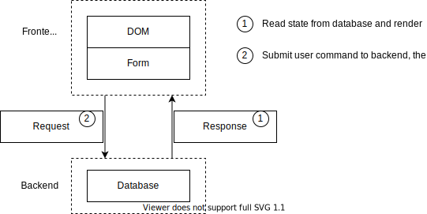

# 界面绑定数据库

这个例子演示了如何把让界面和数据库进行联动。界面始终反应数据库里的最新状态。覆盖的状态范围如下图所示



代码中的

* CounterList / CounterForm 承担了 DOM 状态和表单状态
* Counter 承担了 Request 状态，Response 状态以及数据库状态

这个案例里展示了以下特性

# 绑定到 RPC 查询

Vue 等前端框架虽然支持数据绑定，但是都只能绑定到一个前端内的本地状态。TSM 把绑定的边界拓展了，支持直接写一个 RPC 请求，然后让界面与这个请求的结果进行绑定。当远程数据更新了之后，被绑定的界面也会自动刷新。

```html
    <dynamic :expand="counters">
        <Counter_ #element :counter="#element" />
    </dynamic>
```

```ts
    public get counters() {
        return this.scene.query(Counter);
    }
```

上面绑定的 counters 就是一个执行 RPC 查询的 getter。

```
    public onAdd() {
        this.scene.add(Counter);
    }
```

因为 Counter 上标记了 @Biz.published，所以做为 api 直接在网络上暴露了。add 之后，绑定的 counters 查询会重新执行一遍。这样做的收益就是事实上表单状态是没有的，相当于直接数据库状态绑定到了DOM上。

# 勾选框联动

当没有勾选的时候，delete按钮不出现。勾选了之后，delete 按钮才出现。这个需求本质上是要求两个状态保持一致。按照 Vue 的写法，delete按钮是否可见是可以写成一个 getter 的。但是前提是是否勾选了需要能够被这个 getter 访问到，这就要求上一个独立于组件状态之外的 store 来共享数据了。

```ts
    public get hasSelected() {
        for (const form of this.scene.query(CounterForm)) {
            if (form.checked) {
                return true;
            }
        }
        return false;
    }
```

TSM 的解决办法是 Ui as Database。CounterForm 既是 Ui 组件，同时又是一份可以被 query 的前端状态。然后我们把 delete 按钮是否可见的属性和这个查询进行绑定。一旦勾选，就会联动刷新。

```ts
    public onDelete() {
        const deleted = [];
        for (const form of this.scene.query(CounterForm)) {
            if (form.checked) {
                deleted.push(form.counter);
            }
        }
        this.call(BatchDeleteCounters, deleted);
    }
```

提交表单的时候，也可以是用这个来实现仅删除选中的 counter。

# 总结

这个案例的主旨是绑定到查询。这个查询可以是跨网络边界的远程查询，也可以把Ui组件当成数据库来看待，对兄弟组件的状态的查询。