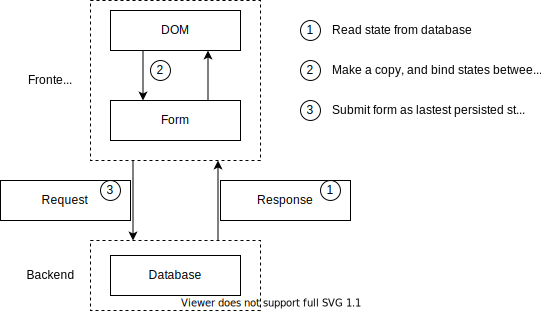

# 批量操作型界面

案例3演示的绑定到数据库有一个缺陷是每次操作都要立即提交。当产品的需求是操作先“缓存”在界面上，在点保存按钮的时候再批量提交就需要用案例4里的方案来做。覆盖的状态范围如下图所示：



代码中的

* CounterList / CounterForm 承担了 DOM 状态和表单状态，以及 Request 状态
* Counter 承担了 Response 状态以及数据库状态

这个案例里展示了以下特性

# 子表单的批量

批量就是在前端持有状态。

```ts
    public onBegin() {
        this.value = this.counter?.value || 0;
    }
```

在 onBegin 的时机（可以认为是 React 生命周期里的 onMount），把持久化的数据库状态复制一份变成可以在前端编辑的表单状态。

```ts
    @Biz.command({ runAt: 'server' })
    public save() {
        if (this.counter) {
            if (this.deleted) {
                this.scene.delete(this.counter);
            } else {
                this.counter.value = this.value;
            }
        } else {
            this.scene.add(Counter, { value: this.value })
        }
    }
```

在 save 按钮触发的时候，把表单状态写回到数据库。

# 父表单的批量

父表单持有的状态更复杂一些是一个 array

```ts
    public onBegin() {
        for (const counter of this.scene.query(Counter)) {
            this.counters.push(this.scene.add(CounterForm, { counter }));
        }
    }
```

类似的在 onBegin 的时机做了一份状态复制。因为有了这份副本

```ts
    public onAdd() {
        this.counters.push(this.scene.add(CounterForm));
    }
```

添加按钮就不需要去调用后端接口了，而是直接修改前端的状态。

```ts
    @Biz.command({ runAt: 'server' })
    @Biz.published
    public onSave() {
        for (const form of this.counters) {
            form.save();
        }
    }
```

在 save 的时候，把表单状态写回到数据库。按照这个模式，更复杂的批量界面也是照葫芦画瓢，无非是定义一个前端持有的对象图，在 onBegin 的时候做一次拷贝，然后在 save 的时候再拷贝回去。

# 总结

批量操作的界面是更复杂的，因为多了一份表单状态需要管理。如果可能的话，优先说服产品经理不要设计这样的界面出来。

如果一定要做批量型界面，TSM 提供了 onBegin 的生命周期回调，让你可以选择绑定到前端状态，而不是只能绑定到数据库。