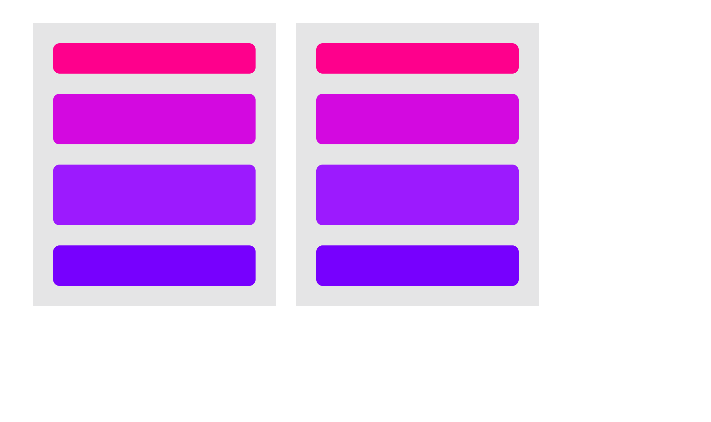
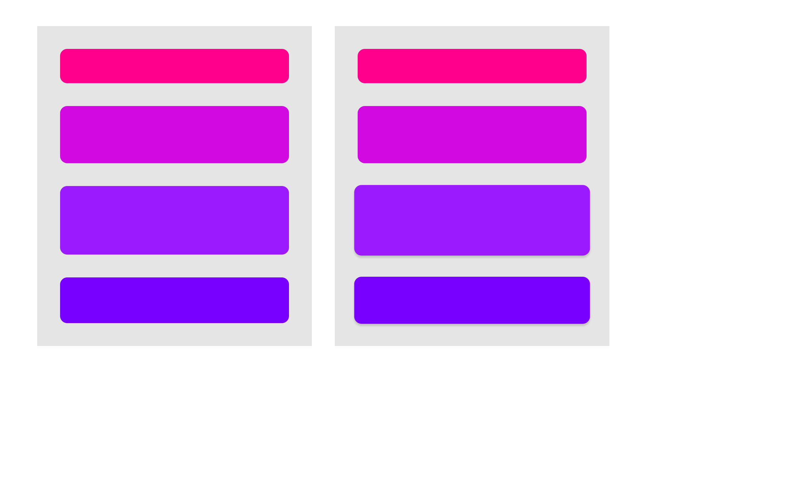

# 拖拽重排

该例子实现了如下功能：

* 通过拖拽在两个 tower 之间移动 disk
* 移动过程有弹簧动效
* 拖放到 tower 区域之外会回滚本次拖放的改动
* 每一次拖放会新增一个 action 到右侧的列表中
* 点击 undo action 回滚 tower 状态到这次 action 之前

下面是几个 gif 动画演示

## 正常拖拽重排



## undo


## 拖放到区域外回滚



# 极易使用的拖拽和动画 api

framer-motion 把复杂的拖拽和动画功能包装在简单的 api 之下。用法参见 framer-motion 的官网。

AnimatedBox 是对 framer-motion 的进一步包装，额外提供了 onDragOver, onDragEnter, onDragExit 回调，并且给 onDropEnd 增加了 droppable 参数，以告知是否拖拽到了区域之外。

# 基于 DOM 的拖拽计算

framer-motion 的官方例子里（https://codesandbox.io/s/framer-motion-2-drag-to-reorder-fc4rt），拖拽中的状态计算是基于 react state 做的，这就要求把 DOM 的状态同步回 react，然后进行计算。

```ts
const unsorted = Array.from(droppable.element.children);
if (!unsorted.includes(dragging.element)) {
    unsorted.push(dragging.element);
}
const sorted = (unsorted as HTMLDivElement[]).sort((a, b) => {
    return Tower.getDiskYCoordinate(a, dragging.element, delta) - Tower.getDiskYCoordinate(b, dragging.element, delta);
});

private static getDiskYCoordinate(elem: HTMLElement, draggingElement: HTMLElement, delta: BoxDelta) {
    if (elem === draggingElement) {
        if (delta.y.translate > 0) {
            // the bottom edge
            return elem.offsetTop + elem.offsetHeight + delta.y.translate;
        } else {
            // the top edge
            return elem.offsetTop + delta.y.translate;
        }
    }
    // the middle
    return elem.offsetTop + elem.offsetHeight / 2;
}
```

而 TSM 对于动画和拖拽的观点是，这些 DOM 上的坐标数据应该属于 DOM 自己管理。所以，我们在拖拽过程的计算直接使用 element.children 获得子元素，使用 offsetTop/offsetHeight 获得元素的位置。我们认为这样的计算更加直观，效率上也省掉了一次状态的复制。

# 基于 Model 的位置重排

当我们发现拖拽引起了位置的变化之后，重排仍然是通过修改 model 状态，触发 react 重渲染来完成的。这个直接使用 react 就很困难，因为计算位置的时候用的是 DOM，从 DOM 是无法反查到 react 组件的。也就是 DOM 状态和 react state 是完全隔离的两个世界。TSM 允许从 DOM 反查对应这个 DOM 元素的 model，通过 data-model-class 和 data-model-id 这两个html属性。

```ts
const sortedDisks = [];
let changed = false;
for (const [i, elem] of sorted.entries()) {
    if (!this.disks[i] || this.disks[i].id !== elem.dataset.modelId!) {
        changed = true;
    }
    const disk = Biz.getSceneMemEntity(this.scene, Disk, elem.dataset.modelId!);
    if (disk.parent !== this as any) {
        disk.parent.removeDisk(disk);
        disk.parent = this as any;
    }
    sortedDisks.push(disk);
}
if (changed) {
    this.disks = sortedDisks;
}
```

上面的例子里，`elem.dataset.modelId` 就是这个我们能够把 DOM 排序的结果映射回 model 的关键。

# undo/redo 框架

手工实现 undo/redo 是很麻烦的。TSM 托管了状态，所以可以帮你省掉很多实现 undo/redo 的成本。

```ts
@context(ActionHistoryContext)
private actionHistory: ActionHistory;

@Biz.unmanaged
public onDragStart() {
    this.actionHistory.beginAction();
}

@Biz.unmanaged
public onDragEnd({ droppable }: onDragEndArgs) {
    if (droppable) {
        this.actionHistory.commitAction();
    } else {
        this.actionHistory.rollbackAction();
    }
}
```

ActionHistory 是框架提供的通用实现。在拖放出区域之后，droppable 就会变成 undefined，这个时候 rollbackAction 就会把本次拖拽的所有状态修改都回退掉。actionHistory 也提供了 undo 方法，把状态回退到某步操作之前。